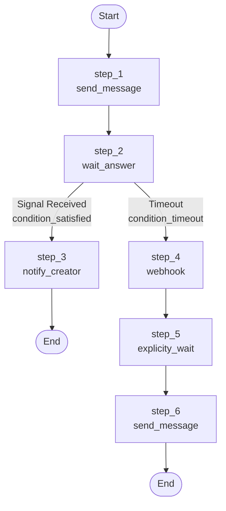

# Temporal POC - Dynamic Workflow Orchestration System

A Proof of Concept demonstrating a dynamic, node-based workflow orchestration system built on Temporal. This system allows you to define workflows declaratively using a map-based definition structure, with support for conditional branching, signal handling, and timeout management.

## Setup

### Prerequisites

- Go 1.23 or later
- Docker and Docker Compose
- Git

### Step 1: Clone and Start Temporal Server

First, clone the Temporal Docker Compose repository and start the Temporal server:

```bash
# Clone the temporal-docker-compose repository
git clone https://github.com/temporalio/docker-compose.git temporal-docker-compose
cd temporal-docker-compose

# Start Temporal server with Docker Compose
docker-compose up -d
```

This will start the Temporal server on `localhost:7233` with the default configuration. The server includes:
- Temporal Server
- PostgreSQL (for persistence)
- Elasticsearch (for visibility/search)

Wait for all services to be healthy before proceeding. You can verify by checking the Temporal Web UI at `http://localhost:8088`.

### Step 2: Start the Worker

In one terminal, start the Temporal worker that will process workflow tasks:

```bash
cd /path/to/temporal-poc
go run ./cmd/worker
```

The worker will:
- Connect to the Temporal server
- Register all workflow and activity handlers
- Listen on the task queue `primary-workflow-task-queue`
- Automatically register search attributes if needed

You should see output indicating the worker has started successfully.

### Step 3: Start the Server (HTTP API)

In another terminal, start the HTTP server that provides REST endpoints for workflow management:

```bash
cd /path/to/temporal-poc
go run ./cmd/server
```

The server will start on port `8081` and provides the following endpoints:
- `POST /start-workflow` - Start a new workflow
- `POST /send-signal` - Send a signal to a running workflow

### Step 4: Test the System

You can test the system by starting a workflow:

```bash
# Start a workflow
curl -X POST http://localhost:8081/start-workflow \
  -H "Content-Type: application/json" \
  -d '{}'

# Send a signal to the workflow (replace WORKFLOW_ID with the ID from the response)
curl -X POST http://localhost:8081/send-signal \
  -H "Content-Type: application/json" \
  -d '{"workflow_id": "WORKFLOW_ID", "signal_name": "client-answered"}'
```

Alternatively, you can use the client directly:

```bash
go run ./cmd/client
```

## Architecture

### Overview

This system implements a **dynamic workflow orchestration engine** that separates workflow definition from execution logic. The architecture follows these key principles:

1. **Node-Based Architecture**: Business logic is encapsulated in reusable nodes
2. **Declarative Workflow Definitions**: Workflows are defined as data structures (maps) rather than code
3. **Separation of Concerns**: Workflow orchestration, node execution, and activity processing are separated
4. **Event-Driven Flow Control**: Conditional branching is based on event types returned by nodes

### System Components

```
┌─────────────────────────────────────────────────────────────┐
│                    Temporal Server                          │
│  (Workflow Execution, History, Task Queue Management)      │
└─────────────────────────────────────────────────────────────┘
                            ▲
                            │
        ┌───────────────────┴───────────────────┐
        │                                       │
┌───────▼────────┐                    ┌────────▼───────┐
│   Worker       │                    │  HTTP Server   │
│  (cmd/worker)  │                    │  (cmd/server)  │
│                │                    │                │
│ - Registers    │                    │ - Start        │
│   Workflows    │                    │   Workflows    │
│ - Registers    │                    │ - Send Signals │
│   Activities   │                    │                │
│ - Processes    │                    │                │
│   Tasks        │                    │                │
└────────────────┘                    └────────────────┘
        │                                       │
        └───────────────────┬───────────────────┘
                            │
                ┌───────────▼───────────┐
                │   Workflow Engine     │
                │  (src/workflows)      │
                └───────────┬───────────┘
                            │
        ┌───────────────────┴───────────────────┐
        │                                       │
┌───────▼────────┐                    ┌────────▼───────┐
│  Registry      │                    │  Node Container│
│  (src/register)│                    │  (src/nodes)   │
│                │                    │                │
│ - Orchestrates │                    │ - Stores Node  │
│   Flow         │                    │   Processors   │
│ - Executes     │                    │ - Provides     │
│   Steps        │                    │   Node Lookup  │
│ - Handles      │                    │                │
│   Conditions   │                    │                │
└────────────────┘                    └────────────────┘
```

### Core Concepts

#### 1. Workflow Definition

A **Workflow Definition** is a declarative structure that defines the workflow's execution flow. It consists of:

- **Steps**: A map of step names to step definitions
- **Start Step**: The entry point of the workflow

```go
type WorkflowDefinition struct {
    Steps     map[string]StepDefinition `json:"steps"`
    StartStep string                    `json:"start_step"`
}
```

Each step definition can have:
- **Node**: The node name to execute (e.g., "send_message", "wait_answer")
- **GoTo**: Simple linear flow to the next step (optional)
- **Condition**: Conditional branching based on event types (optional)

```go
type StepDefinition struct {
    Node      string            `json:"node"`
    GoTo      string            `json:"go_to"`     // Optional
    Condition *domain.Condition `json:"condition"` // Optional
}
```

#### 2. Nodes

**Nodes** are the fundamental building blocks of workflows. Each node represents a unit of work that can:

- Execute workflow logic (wait for signals, timers, etc.)
- Execute activity logic (external operations, API calls, etc.)
- Return event types that control workflow flow

Nodes are registered in a **Node Container** using an initialization function:

```go
func init() {
    RegisterNode(NodeName, nodeProcessorFunction)
}
```

The container maintains a registry of all available nodes, allowing dynamic lookup and execution.

#### 3. Event Types

**Event Types** are the mechanism for conditional branching. Nodes return event types that determine the next step in the workflow:

- `condition_satisfied`: Condition was met (e.g., signal received)
- `condition_not_satisfied`: Condition was not met
- `condition_timeout`: Timeout occurred

```go
type EventType string

const (
    EventTypeConditionSatisfied    EventType = "condition_satisfied"
    EventTypeConditionNotSatisfied EventType = "condition_not_satisfied"
    EventTypeConditionTimeout      EventType = "condition_timeout"
)
```

#### 4. Conditions

**Conditions** define conditional branching logic. They map event types to next steps:

```go
type Condition struct {
    Satisfied    string `json:"satisfied"`     // Next step when satisfied
    NotSatisfied string `json:"not_satisfied"` // Next step when not satisfied
    Timeout      string `json:"timeout"`       // Next step when timeout
}
```

### Deep Dive: Workflow Definition Structure

#### Example Workflow Definition

Let's examine the workflow definition used in this POC:

```go
definition := register.WorkflowDefinition{
    StartStep: "step_1",
    Steps: map[string]register.StepDefinition{
        "step_1": {
            Node: "send_message",
            GoTo: "step_2",  // Linear flow
        },
        "step_2": {
            Node: "wait_answer",
            Condition: &domain.Condition{
                Satisfied: "step_3",  // If signal received
                Timeout:   "step_4",  // If timeout occurs
            },
        },
        "step_3": {
            Node: "notify_creator",
            // No GoTo or Condition = workflow ends
        },
        "step_4": {
            Node: "webhook",
            GoTo: "step_5",
        },
        "step_5": {
            Node: "explicity_wait",
            GoTo: "step_6",
        },
        "step_6": {
            Node: "send_message",
            // Workflow ends here
        },
    },
}
```

#### Workflow Flow Graph



#### Flow Execution

1. **Start**: Workflow begins at `step_1` (defined by `StartStep`)
2. **Step 1**: Executes `send_message` node, then goes to `step_2` (via `GoTo`)
3. **Step 2**: Executes `wait_answer` node, which:
   - Waits for "client-answered" signal OR
   - Waits for timeout (1 minute)
   - Returns `condition_satisfied` or `condition_timeout` event type
   - Based on event type, goes to either `step_3` or `step_4` (via `Condition`)
4. **Step 3** (if signal received): Executes `notify_creator` node, workflow ends
5. **Step 4** (if timeout): Executes `webhook` node, then goes to `step_5`
6. **Step 5**: Executes `explicity_wait` node, then goes to `step_6`
7. **Step 6**: Executes `send_message` node, workflow ends

#### Conditional Branching Logic

The `Condition` struct provides a flexible way to handle multiple outcomes:

```go
func (c *Condition) GetNextStep(eventType EventType) string {
    switch eventType {
    case EventTypeConditionSatisfied:
        return c.Satisfied
    case EventTypeConditionNotSatisfied:
        return c.NotSatisfied
    case EventTypeConditionTimeout:
        return c.Timeout
    default:
        return ""
    }
}
```

If no condition matches and no `GoTo` is defined, the workflow ends.

### Deep Dive: Node Execution Flow

#### Two-Phase Node Execution

Each node execution consists of two phases:

1. **Workflow Node Phase**: Executes in the workflow context
   - Can use Temporal workflow APIs (signals, timers, selectors)
   - Must be deterministic
   - Returns `NodeExecutionResult` with event type

2. **Activity Phase**: Executes as a Temporal activity
   - Can perform non-deterministic operations
   - Can make external API calls
   - Has timeout constraints (max 10 minutes)

#### Execution Flow Diagram

```
┌─────────────────────────────────────────────────────────┐
│  Workflow Execution (registry.Execute)                  │
└────────────────────┬────────────────────────────────────┘
                     │
                     ▼
┌─────────────────────────────────────────────────────────┐
│  ExecuteActivity (src/register/activity_executors.go)   │
│  - Looks up workflow node                               │
│  - Executes workflow node (Phase 1)                     │
│  - Gets NodeExecutionResult with EventType              │
└────────────────────┬────────────────────────────────────┘
                     │
                     ▼
┌─────────────────────────────────────────────────────────┐
│  ExecuteProcessNodeActivity                             │
│  - Executes activity with node name                     │
│  - Activity appears in Temporal UI                      │
└─────────────────────────────────────────────────────────┘
                     │
                     ▼
┌─────────────────────────────────────────────────────────┐
│  ProcessNodeActivity (src/register/activities.go)       │
│  - Placeholder for UI display                           │
│  - Actual logic in workflow node                        │
└─────────────────────────────────────────────────────────┘
```

#### Node Registration and Lookup

Nodes are registered using the `init()` function in each node file:

```go
// In src/nodes/wait_answer.go
func init() {
    RegisterNode(WaitAnswerName, waitAnswerProcessorNode)
}
```

The `Container` maintains a thread-safe registry:

```go
type Container struct {
    nodes map[string]NodeInfo
    mu    sync.RWMutex
}
```

When a node needs to be executed, the registry looks it up:

```go
workflowNode, exists := nodes.GetWorkflowNode(nodeName)
```

### Deep Dive: Activity Registry

The **Activity Registry** (`ActivityRegistry`) is the orchestrator that:

1. **Validates** the workflow definition (checks for circular dependencies)
2. **Executes** steps in order according to the definition
3. **Handles** conditional branching based on event types
4. **Tracks** visited steps to prevent infinite loops
5. **Persists** execution results in workflow memos

#### Registry Execution Algorithm

```go
func (r *ActivityRegistry) Execute(ctx workflow.Context, ...) error {
    currentStep := r.Definition.StartStep
    visitedSteps := make(map[string]bool)
    
    for {
        // 1. Check for infinite loops
        if visitedSteps[currentStep] {
            return error("circular workflow detected")
        }
        visitedSteps[currentStep] = true
        
        // 2. Get step definition
        stepDef := r.Definition.Steps[currentStep]
        
        // 3. Execute node (workflow + activity phases)
        result, err := ExecuteActivity(ctx, stepDef.Node, ...)
        
        // 4. Persist result in memo
        workflow.UpsertMemo(ctx, memo)
        
        // 5. Determine next step
        nextStep := ""
        if stepDef.Condition != nil {
            nextStep = stepDef.Condition.GetNextStep(result.EventType)
        }
        if nextStep == "" && stepDef.GoTo != "" {
            nextStep = stepDef.GoTo
        }
        
        // 6. Move to next step or end
        if nextStep == "" {
            return nil // Workflow ends
        }
        currentStep = nextStep
    }
}
```

### Deep Dive: Node Types

#### 1. Send Message Node

A simple node that simulates sending a message:

```go
func processSendMessageNode(ctx workflow.Context, activityCtx ActivityContext) NodeExecutionResult {
    // Log message sent
    // Sleep deterministically
    // Return success event type
}
```

**Characteristics**:
- No signal waiting
- No timeout logic
- Always returns `condition_satisfied`
- Uses `workflow.Sleep` for deterministic delays

#### 2. Wait Answer Node

A complex node that waits for signals or timeouts:

```go
func waitAnswerProcessorNode(ctx workflow.Context, activityCtx ActivityContext) NodeExecutionResult {
    // Create signal channel
    clientAnsweredChannel := workflow.GetSignalChannel(ctx, "client-answered")
    
    // Set up timer (1 minute timeout)
    timer := workflow.NewTimer(ctx, 1*time.Minute)
    
    // Use selector to wait for either signal or timeout
    selector := workflow.NewSelector(ctx)
    selector.AddReceive(clientAnsweredChannel, ...)
    selector.AddFuture(timer, ...)
    selector.Select(ctx)
    
    // Return appropriate event type
    if signalReceived {
        return NodeExecutionResult{EventType: condition_satisfied}
    } else {
        return NodeExecutionResult{EventType: condition_timeout}
    }
}
```

**Characteristics**:
- Uses Temporal selectors for concurrent waiting
- Updates search attributes when signal received
- Returns different event types based on outcome
- Handles timer cancellation

#### 3. Timeout Webhook Node

A node that handles timeout scenarios:

```go
func timeoutWebhookProcessorNode(ctx workflow.Context, activityCtx ActivityContext) NodeExecutionResult {
    // Process timeout scenario
    // May trigger webhook call
    // Return event type
}
```

### Deep Dive: Search Attributes

**Search Attributes** are used to persist workflow state in a searchable format. This system uses:

- `ClientAnswered` (Bool): Whether the client has answered
- `ClientAnsweredAt` (Datetime): When the client answered

Search attributes are:
- **Indexed**: Can be searched via Temporal's visibility API
- **Persistent**: Survive workflow completion
- **Searchable**: Can query workflows by these attributes

```go
// Update search attributes
workflow.UpsertTypedSearchAttributes(
    ctx,
    core.ClientAnsweredField.ValueSet(true),
    core.ClientAnsweredAtField.ValueSet(workflow.Now(ctx).UTC()),
)
```

### Deep Dive: Validation

The system includes workflow definition validation to prevent:

1. **Circular Dependencies**: Detects cycles in workflow definitions
2. **Invalid Node References**: Ensures all referenced nodes are registered
3. **Missing Start Step**: Validates that start step exists

The validation uses **Depth-First Search (DFS)** to detect cycles:

```go
func ValidateWorkflowDefinition(definition WorkflowDefinition) error {
    // DFS traversal to detect cycles
    // Check all paths from start step
    // Validate node names exist
}
```

### State Safety and Determinism

Temporal workflows must be **deterministic** - given the same event history, they produce the same result. This system ensures determinism by:

1. **Using Temporal APIs**: All time operations use `workflow.Now()`, not `time.Now()`
2. **Deterministic Sleep**: Uses `workflow.Sleep()` instead of `time.After()`
3. **No Randomness**: Avoids non-deterministic operations in workflow code
4. **Event Sourcing**: State is reconstructed from event history during replay

#### Worker Restart Scenario

If a worker crashes during workflow execution:

1. **Temporal** automatically reassigns the workflow to another worker
2. **Event History** is sent to the new worker
3. **Replay** occurs from the beginning using the history
4. **State** is reconstructed deterministically
5. **Execution** continues seamlessly from where it left off

All workflow state (variables, timers, signal channels) is reconstructed from the event history, not from worker memory.

## Project Structure

```
temporal-poc/
├── cmd/
│   ├── client/          # CLI client to start workflows
│   ├── server/          # HTTP API server
│   └── worker/          # Temporal worker
├── src/
│   ├── core/
│   │   ├── domain/      # Domain models (EventType, Condition, Queue)
│   │   ├── logger.go    # Logging utilities
│   │   ├── search_attributes.go
│   │   └── signals.go
│   ├── nodes/           # Node implementations
│   │   ├── container.go # Node registry
│   │   ├── send_message.go
│   │   ├── wait_answer.go
│   │   ├── timeout_webhook.go
│   │   ├── notify_creator.go
│   │   └── explicity_wait.go
│   ├── register/        # Workflow orchestration
│   │   ├── activities.go
│   │   └── activity_executors.go
│   ├── validation/      # Workflow definition validation
│   │   └── workflow.go
│   └── workflows/       # Workflow definitions
│       └── workflow.go
├── go.mod
└── README.md
```

## Key Design Patterns

### 1. Registry Pattern

The `ActivityRegistry` uses the registry pattern to:
- Store workflow definitions
- Orchestrate step execution
- Handle conditional branching

### 2. Container Pattern

The `Container` uses the singleton pattern to:
- Maintain a global registry of nodes
- Provide thread-safe node lookup
- Enable dynamic node registration

### 3. Strategy Pattern

Each node implements the same interface (`ActivityProcessor`) but provides different strategies:
- Different signal handling
- Different timeout logic
- Different activity processing

### 4. Chain of Responsibility (Implicit)

While not explicitly implemented as a chain, the workflow definition acts as a chain:
- Each step processes its node
- Determines next step based on result
- Passes control to next step

## Extending the System

### Adding a New Node

1. **Create node file** in `src/nodes/`:

```go
package nodes

var MyNewNodeName = "my_new_node"

func init() {
    RegisterNode(MyNewNodeName, myNewNodeProcessor)
}

func myNewNodeProcessor(ctx workflow.Context, activityCtx ActivityContext) NodeExecutionResult {
    // Workflow logic here
    // Can use signals, timers, etc.
    
    return NodeExecutionResult{
        Error:        nil,
        ActivityName: MyNewNodeName,
        EventType:    domain.EventTypeConditionSatisfied,
    }
}
```

2. **Use in workflow definition**:

```go
"step_x": {
    Node: "my_new_node",
    GoTo: "step_y",
}
```

### Modifying Workflow Definition

The workflow definition is currently hardcoded in `src/workflows/workflow.go`. To modify:

1. Edit the `definition` variable in the `Workflow` function
2. Add/remove/modify steps
3. Update conditional branching logic
4. The system will automatically validate the definition

**Future Enhancement**: The definition could be loaded from:
- JSON/YAML files
- Database
- API endpoints
- Drag-and-drop UI configuration

## API Reference

### HTTP Server Endpoints

#### POST /start-workflow

Start a new workflow execution.

**Request Body**:
```json
{
  "workflow_id": "optional-custom-id"
}
```

**Response**:
```json
{
  "workflow_id": "abandoned_cart-abc123",
  "run_id": "xyz789",
  "message": "Workflow started successfully"
}
```

#### POST /send-signal

Send a signal to a running workflow.

**Request Body**:
```json
{
  "workflow_id": "abandoned_cart-abc123",
  "run_id": "optional-run-id",
  "signal_name": "client-answered"
}
```

**Response**:
```json
{
  "message": "Successfully sent 'client-answered' signal to workflow: abandoned_cart-abc123"
}
```

## Troubleshooting

### Search Attributes Not Registered

If you see errors about search attributes:

```bash
# Register manually using Temporal CLI
temporal operator search-attributes add -name ClientAnswered -type Bool
temporal operator search-attributes add -name ClientAnsweredAt -type Datetime
```

### Worker Not Processing Tasks

1. Check that Temporal server is running: `docker ps`
2. Verify worker is connected: Check worker logs
3. Ensure task queue name matches: `primary-workflow-task-queue`

### Workflow Stuck

1. Check Temporal Web UI: `http://localhost:8088`
2. View workflow execution history
3. Check for errors in workflow logs
4. Verify signals are being sent correctly

## Future Enhancements

- [ ] Dynamic workflow definition loading (JSON/YAML)
- [ ] Visual workflow builder (drag-and-drop UI)
- [ ] Workflow versioning and migration
- [ ] Enhanced error handling and retry logic
- [ ] Workflow templates and parameterization
- [ ] Metrics and observability integration
- [ ] Multi-tenant support
  - [ ] Tenant isolation
    - [ ] Each tenant has separate workflow definitions, execution history, and state
    - [ ] Workflows from one tenant cannot access or interfere with another tenant's workflows
  - [ ] Data separation
    - [ ] Workflow IDs, signals, and search attributes are scoped per tenant
    - [ ] Each tenant sees only their own workflows in the UI/API
  - [ ] Resource management
    - [ ] Task queues, workers, or namespaces can be partitioned or shared with isolation
    - [ ] Quotas, rate limits, or resource allocation per tenant
  - [ ] Security and access control
    - [ ] Authentication/authorization tied to tenant identity
    - [ ] API requests and operations scoped to the authenticated tenant
- [ ] Workflow scheduling and cron support
