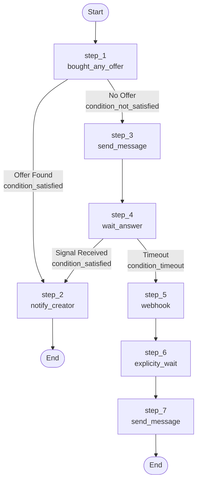

# Temporal POC - Dynamic Workflow Orchestration System

---

A Proof of Concept demonstrating a dynamic, node-based workflow orchestration system built on Temporal. This system allows you to define workflows declaratively using a map-based definition structure, with support for conditional branching, signal handling, and timeout management.

## Setup

---

### Prerequisites

---

- Go 1.23 or later
- Docker and Docker Compose
- Git

### Step 1: Clone and Start Temporal Server

---

First, clone the Temporal Docker Compose repository and start the Temporal server:

```bash
# Clone the temporal-docker-compose repository
git clone https://github.com/temporalio/docker-compose.git temporal-docker-compose
cd temporal-docker-compose

# Start Temporal server with Docker Compose
docker-compose up -d
```

This will start the Temporal server on `localhost:7233` with the default configuration. The server includes:
- Temporal Server
- PostgreSQL (for persistence)
- Elasticsearch (for visibility/search)

Wait for all services to be healthy before proceeding. You can verify by checking the Temporal Web UI at `http://localhost:8088`.

### Step 2: Start the Worker

---

In one terminal, start the Temporal worker that will process workflow tasks:

```bash
cd /path/to/temporal-poc
go run ./cmd/worker
```

The worker will:
- Connect to the Temporal server
- Register all workflow and activity handlers
- Listen on the task queue `primary-workflow-task-queue`
- Automatically register search attributes if needed

You should see output indicating the worker has started successfully.

### Step 3: Start the Server (HTTP API)

---

In another terminal, start the HTTP server that provides REST endpoints for workflow management:

```bash
cd /path/to/temporal-poc
go run ./cmd/server
```

The server will start on port `8081` and provides the following endpoints:
- `GET /nodes` - Get all available nodes with schemas and information
- `POST /start-workflow` - Start a new workflow
- `POST /send-signal` - Send a signal to a running workflow

### Step 4: Test the System

---

You can test the system by starting a workflow:

```bash
# Get all available nodes with their schemas
curl -X GET http://localhost:8081/nodes

# Start a workflow
curl -X POST http://localhost:8081/start-workflow \
  -H "Content-Type: application/json" \
  -d '{
    "workflow_id": "optional-custom-id",
    "config": {
      "start_step": "step_1",
      "steps": {
        "step_1": {
          "node": "bought_any_offer",
          "condition": {
            "satisfied": "step_3",
            "not_satisfied": "step_4"
          },
          "schema": {
            "last_minutes": 60
          }
        },
        "step_2": {
          "node": "send_message",
          "go_to": "step_3",
          "schema": {
            "text": "Hello, this is a test message",
            "channel_id": "channel_123"
          }
        },
        "step_3": {
          "node": "notify_creator",
          "go_to": "step_2"
        },
        "step_4": {
          "node": "wait_answer",
          "condition": {
            "satisfied": "step_3",
            "timeout": "step_5"
          },
          "schema": {
            "timeout_seconds": 30
          }
        },
        "step_5": {
          "node": "webhook",
          "go_to": "step_6"
        },
        "step_6": {
          "node": "explicity_wait",
          "go_to": "step_7",
          "schema": {
            "wait_seconds": 15
          }
        },
        "step_7": {
          "node": "send_message",
          "schema": {
            "text": "Final message sent",
            "channel_id": "channel_456"
          }
        }
      }
    }
  }'

# Send a signal to the workflow (replace WORKFLOW_ID with the ID from the response)
curl -X POST http://localhost:8081/send-signal \
  -H "Content-Type: application/json" \
  -d '{"workflow_id": "WORKFLOW_ID", "signal_name": "client-answered"}'
```

Alternatively, you can use the client directly:

```bash
go run ./cmd/client
```

## Architecture

---

### Overview

---

This system implements a **dynamic workflow orchestration engine** that separates workflow definition from execution logic. The architecture follows these key principles:

1. **Node-Based Architecture**: Business logic is encapsulated in reusable nodes
2. **Declarative Workflow Definitions**: Workflows are defined as data structures (maps) rather than code
3. **Separation of Concerns**: Workflow orchestration, node execution, and activity processing are separated
4. **Event-Driven Flow Control**: Conditional branching is based on event types returned by nodes

### System Components

---

```
┌─────────────────────────────────────────────────────────────┐
│                    Temporal Server                          │
│  (Workflow Execution, History, Task Queue Management)       │
└─────────────────────────────────────────────────────────────┘
                            ▲
                            │
        ┌───────────────────┴───────────────────┐
        │                                       │
┌───────▼────────┐                    ┌─────────▼──────┐
│   Worker       │                    │  HTTP Server   │
│  (cmd/worker)  │                    │  (cmd/server)  │
│                │                    │                │
│ - Registers    │                    │ - Start        │
│   Workflows    │                    │   Workflows    │
│ - Registers    │                    │ - Send Signals │
│   Activities   │                    │                │
│ - Processes    │                    │                │
│   Tasks        │                    │                │
└────────────────┘                    └────────────────┘
        │                                       │
        └───────────────────┬───────────────────┘
                            │
                ┌───────────▼───────────┐
                │   Workflow Engine     │
                │  (src/workflows)      │
                └───────────┬───────────┘
                            │
        ┌───────────────────┴───────────────────┐
        │                                       │
┌───────▼────────┐                    ┌─────────▼──────┐
│  Registry      │                    │  Node Container│
│  (src/register)│                    │  (src/nodes)   │
│                │                    │                │
│ - Orchestrates │                    │ - Stores Node  │
│   Flow         │                    │   Processors   │
│ - Executes     │                    │ - Provides     │
│   Steps        │                    │   Node Lookup  │
│ - Handles      │                    │                │
│   Conditions   │                    │                │
└────────────────┘                    └────────────────┘
```

### Core Concepts

---

#### 1. Workflow Definition

---

A **Workflow Definition** is a declarative structure that defines the workflow's execution flow. It consists of:

- **Steps**: A map of step names to step definitions
- **Start Step**: The entry point of the workflow

```go
type WorkflowConfig struct {
    StartStep string                `json:"start_step"` // The starting step name
    Steps     map[string]StepConfig `json:"steps"`      // Map of step names to step definitions
}
```

Each step definition can have:
- **Node**: The node name to execute (e.g., "send_message", "wait_answer")
- **GoTo**: Simple linear flow to the next step (optional)
- **Condition**: Conditional branching based on event types (optional)
- **Schema**: Step-specific input data validated against the node's schema (optional)

```go
type StepConfig struct {
    Node      string                 `json:"node"`                // The node name to execute
    GoTo      string                 `json:"go_to,omitempty"`     // Next step for simple linear flow (optional)
    Condition *domain.Condition      `json:"condition,omitempty"` // Conditional branching based on event types (optional)
    Schema    map[string]interface{} `json:"schema,omitempty"`    // Step schema data (validated against node schema)
}
```

**Note**: The old `WorkflowDefinition` and `StepDefinition` types are deprecated but kept for backward compatibility with validation. New code should use `WorkflowConfig` and `StepConfig`.

#### 2. Nodes

---

**Nodes** are the fundamental building blocks of workflows. Each node represents a unit of work that can:

- Execute workflow logic (wait for signals, timers, etc.) - **Workflow Tasks**
- Execute activity logic (external operations, API calls, etc.) - **Activity Tasks**
- Return event types that control workflow flow
- Define input schemas for validation

##### Node Types: Workflow Tasks vs Activity Tasks

---

The system distinguishes between two types of nodes:

1. **Workflow Tasks** (`NodeTypeWorkflowTask`): Execute directly in the workflow context
   - Can use Temporal workflow APIs (signals, timers, selectors)
   - Must be deterministic
   - Execute synchronously in the workflow
   - Examples: `wait_answer`, `explicity_wait`

2. **Activity Tasks** (`NodeTypeActivity`): Execute as Temporal activities
   - Can perform non-deterministic operations
   - Can make external API calls
   - Execute asynchronously via `workflow.ExecuteActivity`
   - Can return event types to control workflow flow
   - Examples: `send_message`, `notify_creator`, `webhook`, `bought_any_offer`

The system automatically determines the execution method based on how the node is registered.

##### Node Registration

---

Nodes are registered in separate containers based on their type:

**Workflow Task Registration** (`src/nodes/workflow_tasks/`):

```go
func init() {
    // Define schema struct for the node
    schema := &domain.NodeSchema{
        SchemaStruct: WaitAnswerSchema{},
    }
    
    // Register workflow task with schema and retry policy
    // NodeTypeWorkflowTask indicates this executes in workflow context
    RegisterNode(WaitAnswerName, waitAnswerProcessorNode, nil, NodeTypeWorkflowTask, schema)
}
```

**Activity Registration** (`src/nodes/activities/`):

```go
func init() {
    // Define schema struct for the activity
    schema := &domain.NodeSchema{
        SchemaStruct: SendMessageSchema{},
    }
    
    // Register activity with retry policy and schema
    retryPolicy := &temporal.RetryPolicy{
        InitialInterval:    time.Second,
        BackoffCoefficient: 2.0,
        MaximumInterval:    time.Minute,
        MaximumAttempts:    15,
    }
    RegisterActivity(SendMessageName, sendMessageActivity, retryPolicy, schema)
}
```

**Registration Parameters**:
- `name`: The unique identifier for the node (used in workflow definitions)
- `processor/function`: The function that implements the node's logic
- `retryPolicy`: The retry policy for the node. If `nil`, no retry policy is applied
- `nodeType`: For workflow tasks, must be `NodeTypeWorkflowTask`
- `schema`: Optional input schema for validation (see Schema Validation section)

The system maintains separate thread-safe registries for workflow tasks and activities, with a unified `Register` that aggregates both for lookup and execution.

#### 3. Event Types

---

**Event Types** are the mechanism for conditional branching. Nodes return event types that determine the next step in the workflow:

- `condition_satisfied`: Condition was met (e.g., signal received)
- `condition_not_satisfied`: Condition was not met
- `condition_timeout`: Timeout occurred

```go
type EventType string

const (
    EventTypeConditionSatisfied    EventType = "condition_satisfied"
    EventTypeConditionNotSatisfied EventType = "condition_not_satisfied"
    EventTypeConditionTimeout      EventType = "condition_timeout"
)
```

**Activity Event Types**: Activities can return event types to control workflow flow by returning an `ActivityResult`:

```go
type ActivityResult struct {
    Metadata  map[string]interface{} // Metadata for future use (optional, can be nil)
    EventType domain.EventType       // Event type to control workflow flow (ConditionSatified, ConditionNotSatified, Timeout)
}

// Activity functions return (ActivityResult, error) to support retries
type ActivityFunction func(ctx context.Context, activityCtx ActivityContext) (ActivityResult, error)
```

When an activity returns an `ActivityResult` with an `EventType`, the workflow uses that event type to determine the next step based on the step's `Condition`. If no event type is specified, it defaults to `condition_satisfied`.

**Important**: Activities return `(ActivityResult, error)` where:
- Returning an `error` triggers Temporal retries (for retryable failures)
- Returning `(ActivityResult{...}, nil)` indicates success with optional event type
- The `Metadata` field can be used to pass additional information back to the workflow

**Example**: The `bought_any_offer` activity uses random probability (20% chance) to return `condition_satisfied` if an offer is found, or `condition_not_satisfied` (80% chance) if no offer is found, allowing the workflow to branch accordingly.

#### 4. Conditions

---

**Conditions** define conditional branching logic. They map event types to next steps:

```go
type Condition struct {
    Satisfied    string `json:"satisfied"`     // Next step when satisfied
    NotSatisfied string `json:"not_satisfied"` // Next step when not satisfied
    Timeout      string `json:"timeout"`       // Next step when timeout
}
```

### Deep Dive: Workflow Definition Structure

---

#### Example Workflow Definition

---

Let's examine the workflow definition used in this POC:

```go
config := workflows.WorkflowConfig{
    StartStep: "step_1",
    Steps: map[string]workflows.StepConfig{
        "step_1": {
            Node: "bought_any_offer",  // Activity task with conditional branching
            Condition: &domain.Condition{
                Satisfied:    "step_2",  // If offer found (condition_satisfied)
                NotSatisfied: "step_3",  // If no offer found (condition_not_satisfied)
            },
            Schema: map[string]interface{}{  // Schema input validated against node schema
                "last_minutes": int64(60),
            },
        },
        "step_2": {
            Node: "notify_creator",
        },
        "step_3": {
            Node: "send_message",  // Activity task
            GoTo: "step_4",        // Linear flow
            Schema: map[string]interface{}{  // Schema input validated against node schema
                "text":       "Hello, this is a test message",
                "channel_id": "channel_123",
            },
        },
        "step_4": {
            Node: "wait_answer",   // Workflow task (waiter)
            Condition: &domain.Condition{
                Satisfied: "step_2",  // If signal received
                Timeout:   "step_5",  // If timeout occurs
            },
            Schema: map[string]interface{}{  // Schema input validated against node schema
                "timeout_seconds": int64(30),
            },
        },
        "step_5": {
            Node: "webhook",  // Activity task
            GoTo: "step_6",
        },
        "step_6": {
            Node: "explicity_wait",  // Workflow task (waiter)
            GoTo: "step_7",
            Schema: map[string]interface{}{ // Schema input validated against node schema
                "wait_seconds": int64(15),
            },
        },
        "step_7": {
            Node: "send_message",  // Activity task
            // Workflow ends here
            Schema: map[string]interface{}{  // Schema input validated against node schema
                "text":       "Final message sent",
                "channel_id": "channel_456",
            },
        },
    },
}
```

**Key Features**:
- Uses `WorkflowConfig` and `StepConfig` (new structure)
- Mixes workflow tasks (`wait_answer`, `explicity_wait`) and activity tasks (`send_message`, `notify_creator`, `webhook`)
- Includes schema input for `step_4` that is validated against the `wait_answer` node's schema
- Demonstrates both linear flow (`GoTo`) and conditional branching (`Condition`)

#### Workflow Flow Graph

---



#### Flow Execution

---

1. **Start**: Workflow begins at `step_1` (defined by `StartStep`)
2. **Step 1**: Executes `bought_any_offer` activity, which:
   - Checks if user bought any offer in the last N minutes (fake database call with random probability)
   - Uses random probability: 20% chance of `condition_satisfied` (offer found), 80% chance of `condition_not_satisfied` (no offer found)
   - Returns event type based on random result
   - Based on event type, goes to either `step_2` (notify creator) or `step_3` (send message)
3. **Step 2** (if offer found): Executes `notify_creator` node, workflow ends
4. **Step 3** (if no offer found): Executes `send_message` node, then goes to `step_4` (via `GoTo`)
5. **Step 4** (after step_3): Executes `wait_answer` node, which:
   - Waits for "client-answered" signal OR
   - Waits for timeout (30 seconds)
   - Returns `condition_satisfied` or `condition_timeout` event type
   - Based on event type, goes to either `step_2` (notify creator) or `step_5` (webhook)
6. **Step 5** (if timeout): Executes `webhook` node, then goes to `step_6`
7. **Step 6**: Executes `explicity_wait` node, then goes to `step_7`
8. **Step 7**: Executes `send_message` node, workflow ends

#### Conditional Branching Logic

---

The `Condition` struct provides a flexible way to handle multiple outcomes:

```go
func (c *Condition) GetNextStep(eventType EventType) string {
    switch eventType {
    case EventTypeConditionSatisfied:
        return c.Satisfied
    case EventTypeConditionNotSatisfied:
        return c.NotSatisfied
    case EventTypeConditionTimeout:
        return c.Timeout
    default:
        return ""
    }
}
```

If no condition matches and no `GoTo` is defined, the workflow ends.

### Deep Dive: Node Execution Flow

---

#### Execution Methods: Workflow Tasks vs Activity Tasks

---

The system uses different execution methods based on node type:

**Workflow Task Execution**:
- Executes directly in the workflow context (no activity call)
- Uses `executeWorkflowNode()` function
- Processor runs synchronously in workflow
- Can use workflow APIs (signals, timers, selectors)
- Must be deterministic

**Activity Task Execution**:
- Executes via `workflow.ExecuteActivity()`
- Runs as a Temporal activity (asynchronous)
- Can perform non-deterministic operations
- Has timeout constraints (max 10 minutes)
- Uses registered retry policy

#### Execution Flow Diagram

---

```
┌─────────────────────────────────────────────────────────┐
│  Workflow Execution (executeWorkflowConfig)             │
└────────────────────┬────────────────────────────────────┘
                     │
                     ▼
        ┌────────────┴────────────┐
        │                         │
        ▼                         ▼
┌──────────────────┐    ┌──────────────────────┐
│ Workflow Task    │    │ Activity Task        │
│ (wait_answer)    │    │ (send_message)       │
│                  │    │                      │
│ - Direct exec    │    │ - ExecuteActivity    │
│ - In workflow    │    │ - Async execution    │
│ - Deterministic  │    │ - Retry policy       │
└──────────────────┘    └──────────────────────┘
        │                         │
        └────────────┬────────────┘
                     │
                     ▼
        ┌────────────────────────┐
        │ NodeExecutionResult    │
        │ - EventType            │
        │ - ActivityName         │
        └────────────────────────┘
                     │
                     ▼
        ┌────────────────────────┐
        │ Determine Next Step    │
        │ - Check Condition      │
        │ - Check GoTo           │
        └────────────────────────┘
```

#### Unified Register System

---

The system uses a **unified Register** (`src/register/register.go`) that aggregates nodes from both workflow tasks and activities containers. This provides a single interface for node lookup and information retrieval.

**Register Structure**:

```go
type Register struct {
    workflowTasksContainer *workflow_tasks.Container
    activitiesContainer    *activities.Container
    allNodes               map[string]NodeInfo
    mu                     sync.RWMutex
}

type NodeInfo struct {
    Name        string                  // Node name
    Type        workflow_tasks.NodeType // NodeTypeActivity or NodeTypeWorkflowTask
    Caller      NodeCaller              // Processor for workflow tasks, Function for activities
    RetryPolicy *temporal.RetryPolicy   // Retry policy (nil means no retry)
    Schema      *domain.NodeSchema      // Input schema for the node (optional)
}
```

**Node Lookup**:

```go
// Get node information (works for both types)
nodeInfo, exists := register.GetNodeInfo(nodeName)

// Check if node is a workflow task
isWorkflowTask := register.IsWorkflowTask(nodeName)

// Get workflow task processor
processor, exists := register.GetWorkflowNode(nodeName)

// Get activity function
activityFn, exists := register.GetActivityFunction(nodeName)

// Get retry policy
retryPolicy := register.GetRetryPolicy(nodeName)

// Get schema
schema, exists := register.GetNodeInfo(nodeName)
```

**Key points**:
- Registration is thread-safe (uses `sync.RWMutex`)
- Each node must be registered before it can be used in workflow definitions
- The register automatically aggregates nodes from both containers
- Node type is determined at registration time
- Schema information is stored and available for validation

### Deep Dive: Activity Registry

---

The **Activity Registry** (`ActivityRegistry`) is the orchestrator that:

1. **Validates** the workflow definition (checks for circular dependencies)
2. **Executes** steps in order according to the definition
3. **Handles** conditional branching based on event types
4. **Tracks** visited steps to prevent infinite loops
5. **Persists** execution results in workflow memos

#### Registry Execution Algorithm

---

```go
func (r *ActivityRegistry) Execute(ctx workflow.Context, ...) error {
    currentStep := r.Definition.StartStep
    visitedSteps := make(map[string]bool)
    
    for {
        // 1. Check for infinite loops
        if visitedSteps[currentStep] {
            return error("circular workflow detected")
        }
        visitedSteps[currentStep] = true
        
        // 2. Get step definition
        stepDef := r.Definition.Steps[currentStep]
        
        // 3. Execute node (workflow + activity phases)
        result, err := ExecuteActivity(ctx, stepDef.Node, ...)
        
        // 4. Persist result in memo
        workflow.UpsertMemo(ctx, memo)
        
        // 5. Determine next step
        nextStep := ""
        if stepDef.Condition != nil {
            nextStep = stepDef.Condition.GetNextStep(result.EventType)
        }
        if nextStep == "" && stepDef.GoTo != "" {
            nextStep = stepDef.GoTo
        }
        
        // 6. Move to next step or end
        if nextStep == "" {
            return nil // Workflow ends
        }
        currentStep = nextStep
    }
}
```

### Deep Dive: Node Types

---

#### 1. Send Message Node

---

A simple node that simulates sending a message:

```go
func processSendMessageNode(ctx workflow.Context, activityCtx ActivityContext) NodeExecutionResult {
    // Log message sent
    // Sleep deterministically
    // Return success event type
}
```

**Characteristics**:
- No signal waiting
- No timeout logic
- Always returns `condition_satisfied`
- Uses `workflow.Sleep` for deterministic delays
- Configured with retry policy (15 attempts with exponential backoff)

#### 2. Wait Answer Node

---

A complex node that waits for signals or timeouts:

```go
func waitAnswerProcessorNode(ctx workflow.Context, activityCtx ActivityContext) NodeExecutionResult {
    // Create signal channel
    clientAnsweredChannel := workflow.GetSignalChannel(ctx, "client-answered")
    
    // Set up timer (1 minute timeout)
    timer := workflow.NewTimer(ctx, 1*time.Minute)
    
    // Use selector to wait for either signal or timeout
    selector := workflow.NewSelector(ctx)
    selector.AddReceive(clientAnsweredChannel, ...)
    selector.AddFuture(timer, ...)
    selector.Select(ctx)
    
    // Return appropriate event type
    if signalReceived {
        return NodeExecutionResult{EventType: condition_satisfied}
    } else {
        return NodeExecutionResult{EventType: condition_timeout}
    }
}
```

**Characteristics**:
- Uses Temporal selectors for concurrent waiting
- Updates search attributes when signal received
- Returns different event types based on outcome
- Handles timer cancellation

#### 3. Timeout Webhook Node

---

A node that handles timeout scenarios:

```go
func timeoutWebhookProcessorNode(ctx workflow.Context, activityCtx ActivityContext) NodeExecutionResult {
    // Process timeout scenario
    // May trigger webhook call
    // Return event type
}
```

#### 4. Explicity Wait Node

---

A simple workflow task node that waits for a configurable duration:

```go
func processExplicityWaitNode(ctx workflow.Context, activityCtx ActivityContext) NodeExecutionResult {
    // Get wait duration from schema
    waitDuration := 15 * time.Second
    if schema, err := helpers.UnmarshalSchema[ExplicityWaitSchema](activityCtx.Schema); err == nil {
        if schema.WaitSeconds > 0 {
            waitDuration = time.Duration(schema.WaitSeconds) * time.Second
        }
    }
    
    // Use workflow.Sleep for deterministic waiting
    workflow.Sleep(ctx, waitDuration)
    
    return NodeExecutionResult{
        EventType: condition_satisfied,
    }
}
```

**Schema**:
```go
type ExplicityWaitSchema struct {
    WaitSeconds int64 `json:"wait_seconds" jsonschema:"description=Wait in seconds,required"`
}
```

**Characteristics**:
- Uses `workflow.Sleep` for deterministic waiting
- Configurable wait duration via schema input
- Defaults to 15 seconds if schema not provided
- Always returns `condition_satisfied` after waiting
- Must be deterministic (no external calls)

**Usage in workflow**:
```go
"step_6": {
    Node: "explicity_wait",
    GoTo: "step_7",
    Schema: map[string]interface{}{
        "wait_seconds": int64(15),
    },
}
```

### Deep Dive: Search Attributes

---

**Search Attributes** are used to persist workflow state in a searchable format. This system uses:

- `ClientAnswered` (Bool): Whether the client has answered
- `ClientAnsweredAt` (Datetime): When the client answered

Search attributes are:
- **Indexed**: Can be searched via Temporal's visibility API
- **Persistent**: Survive workflow completion
- **Searchable**: Can query workflows by these attributes

```go
// Update search attributes
workflow.UpsertTypedSearchAttributes(
    ctx,
    core.ClientAnsweredField.ValueSet(true),
    core.ClientAnsweredAtField.ValueSet(workflow.Now(ctx).UTC()),
)
```

### Deep Dive: Schema Validation

---

The system includes **schema validation** that allows nodes to define input schemas and validates step inputs against those schemas.

#### Node Schema Definition

---

Nodes can define input schemas using Go structs that are automatically converted to JSON Schema for validation. The system uses **JSON Schema tags** (`jsonschema`) to define validation rules, descriptions, and constraints.

**JSON Schema Documentation**:
- **JSON Schema Specification**: https://json-schema.org/
- **invopop/jsonschema** (Go struct to JSON Schema converter): https://github.com/invopop/jsonschema
- **santhosh-tekuri/jsonschema/v5** (JSON Schema validator): https://github.com/santhosh-tekuri/jsonschema

##### Basic Schema Definition

```go
// Define schema struct
type WaitAnswerSchema struct {
    TimeoutSeconds int64 `json:"timeout_seconds" jsonschema:"description=Timeout in seconds,required"`
}

// Register node with schema
func init() {
    schema := &domain.NodeSchema{
        SchemaStruct: WaitAnswerSchema{},
    }
    RegisterNode(WaitAnswerName, waitAnswerProcessorNode, nil, NodeTypeWorkflowTask, schema)
}
```

##### JSON Schema Tag Options

The `jsonschema` tag supports various options to define validation rules. Multiple options are separated by commas:

**Common Options**:
- `required` - Field is required (must be provided)
- `description=<text>` - Human-readable description of the field
- `minimum=<number>` - Minimum value for numeric types
- `maximum=<number>` - Maximum value for numeric types
- `minLength=<number>` - Minimum length for strings
- `maxLength=<number>` - Maximum length for strings
- `pattern=<regex>` - Regular expression pattern for strings
- `enum=<value1,value2,...>` - Enumeration of allowed values
- `default=<value>` - Default value if not provided

##### Complete Examples

**Example 1: Numeric Field with Minimum Value**

```go
// bought_any_offer activity schema
type BoughtAnyOfferSchema struct {
    LastMinutes int64 `json:"last_minutes" jsonschema:"description=Number of minutes to check,required,minimum=0"`
}
```

This schema:
- Requires `last_minutes` to be provided
- Ensures the value is 0 or greater
- Provides a description for documentation

**Example 2: String Field with Length Constraints**

```go
type MessageSchema struct {
    Message string `json:"message" jsonschema:"description=Message to send,required,minLength=1,maxLength=500"`
}
```

**Example 3: Enum Field**

```go
type StatusSchema struct {
    Status string `json:"status" jsonschema:"description=Current status,required,enum=active,inactive,pending"`
}
```

**Example 4: Multiple Fields with Different Types**

```go
type CompleteSchema struct {
    // Required integer with minimum
    TimeoutSeconds int64 `json:"timeout_seconds" jsonschema:"description=Timeout in seconds,required,minimum=1,maximum=3600"`
    
    // Optional string with pattern
    Email string `json:"email,omitempty" jsonschema:"description=Email address,pattern=^[a-zA-Z0-9._%+-]+@[a-zA-Z0-9.-]+\\.[a-zA-Z]{2,}$"`
    
    // Required string with length constraints
    Name string `json:"name" jsonschema:"description=Name of the item,required,minLength=1,maxLength=100"`
    
    // Optional boolean with default
    Enabled bool `json:"enabled,omitempty" jsonschema:"description=Whether the feature is enabled,default=true"`
}
```

**Example 5: Real-World Example from bought_any_offer**

```go
// BoughtAnyOfferSchema defines the input schema for bought_any_offer activity
type BoughtAnyOfferSchema struct {
    LastMinutes int64 `json:"last_minutes" jsonschema:"description=Number of minutes to check,required,minimum=0"` // Required: number of minutes to check
}

func init() {
    // Define schema for validation
    schema := &domain.NodeSchema{
        SchemaStruct: BoughtAnyOfferSchema{},
    }
    
    RegisterActivity(BoughtAnyOfferActivityName, BoughtAnyOfferActivity, retryPolicy, schema)
}

// Activity function returns (ActivityResult, error) for retry support
func BoughtAnyOfferActivity(ctx context.Context, activityCtx ActivityContext) (ActivityResult, error) {
    // ... validation and database query logic ...
    
    // Use random probability: 20% satisfied, 80% not satisfied
    randomValue := rand.Intn(101) // Random number from 0 to 100
    offerFound := randomValue < 20 // 20% chance (0-19 = satisfied)
    
    if offerFound {
        return ActivityResult{
            EventType: domain.EventTypeConditionSatisfied,
        }, nil
    }
    
    return ActivityResult{
        EventType: domain.EventTypeConditionNotSatisfied,
    }, nil
}
```

**Usage in workflow**:
```go
"step_1": {
    Node: "bought_any_offer",
    Condition: &domain.Condition{
        Satisfied:    "step_2",    // 20% chance - notify creator
        NotSatisfied: "step_3",    // 80% chance - send message then wait answer
    },
    Schema: map[string]interface{}{
        "last_minutes": int64(60), // Must be >= 0, validated automatically
    },
}
```

**Example 6: Multiple Required String Fields (send_message)**

```go
// SendMessageSchema defines the input schema for send_message activity
type SendMessageSchema struct {
    Text      string `json:"text" jsonschema:"description=Message text to send,required"`
    ChannelID string `json:"channel_id" jsonschema:"description=Channel ID where message will be sent,required"`
}

func init() {
    // Define schema for validation
    schema := &domain.NodeSchema{
        SchemaStruct: SendMessageSchema{},
    }
    
    retryPolicy := &temporal.RetryPolicy{
        InitialInterval:    time.Second,
        BackoffCoefficient: 2.0,
        MaximumInterval:    time.Minute,
        MaximumAttempts:    15,
    }
    
    RegisterActivity(SendMessageActivityName, SendMessageActivity, retryPolicy, schema)
}
```

This schema:
- Requires both `text` and `channel_id` to be provided
- Both fields are strings with descriptions
- Validates that both fields are present when the activity is called

**Usage in workflow**:
```go
"step_3": {
    Node: "send_message",
    GoTo: "step_4",
    Schema: map[string]interface{}{
        "text":       "Hello, this is a test message",
        "channel_id": "channel_123",
    },
}
```

**Example 7: Required URL with Regex Pattern and Optional Body (webhook)**

```go
// WebhookSchema defines the input schema for webhook activity
type WebhookSchema struct {
    URL  string `json:"url" jsonschema:"description=Webhook URL to call,required,pattern=^https?://.+"`
    Body string `json:"body,omitempty" jsonschema:"description=Optional request body to send with the webhook"`
}

func init() {
    // Define schema for validation
    schema := &domain.NodeSchema{
        SchemaStruct: WebhookSchema{},
    }
    
    retryPolicy := &temporal.RetryPolicy{
        InitialInterval:    time.Second,
        BackoffCoefficient: 2.0,
        MaximumInterval:    time.Minute,
        MaximumAttempts:    15,
    }
    
    RegisterActivity(TimeoutWebhookActivityName, TimeoutWebhookActivity, retryPolicy, schema)
}
```

This schema:
- Requires `url` to be provided and validates it matches the pattern `^https?://.+` (must start with `http://` or `https://`)
- `body` is optional (no `required` tag and `omitempty` in JSON tag)
- Both fields have descriptions for documentation

**Usage in workflow**:
```go
"step_5": {
    Node: "webhook",
    GoTo: "step_6",
    Schema: map[string]interface{}{
        "url":  "https://example.com/webhook",
        "body": "{\"event\": \"timeout\", \"workflow_id\": \"abc123\"}",
    },
}

// Or without body (optional field):
"step_5": {
    Node: "webhook",
    GoTo: "step_6",
    Schema: map[string]interface{}{
        "url": "https://example.com/webhook",
    },
}
```

##### JSON Schema Tag Syntax

The `jsonschema` tag uses comma-separated key-value pairs:

```
jsonschema:"key1=value1,key2=value2,key3=value3"
```

**Important Notes**:
- Values with spaces should not be quoted (the parser handles them)
- Special characters in regex patterns may need escaping
- Boolean values (`required`) don't need a value, just the keyword
- Numeric constraints (`minimum`, `maximum`) work with `int`, `int64`, `float32`, `float64`
- String constraints (`minLength`, `maxLength`, `pattern`) work with `string` types

#### Step Schema Input

---

Steps can provide input data that is validated against the node's schema:

```go
"step_4": {
    Node: "wait_answer",
    Condition: &domain.Condition{
        Satisfied: "step_3",
        Timeout:   "step_5",
    },
    Schema: map[string]interface{}{
        "timeout_seconds": int64(30),
    },
}
```

#### Schema Validation Process

---

The schema validation process uses industry-standard JSON Schema:

1. **Schema Conversion**: Go structs are converted to JSON Schema using [`invopop/jsonschema`](https://github.com/invopop/jsonschema)
   - Reflects Go struct tags to generate JSON Schema
   - Supports `jsonschema` tags for validation rules
   - Converts struct types to JSON Schema types automatically

2. **Input Validation**: Step input is validated against JSON Schema using [`santhosh-tekuri/jsonschema/v5`](https://github.com/santhosh-tekuri/jsonschema)
   - Validates data against JSON Schema Draft 7 specification
   - Provides detailed error messages for validation failures
   - Supports all standard JSON Schema constraints

3. **Error Reporting**: Validation errors include node name and specific field errors
   - Errors are returned before workflow execution
   - Includes field path and validation reason
   - Prevents invalid workflows from starting

**JSON Schema Resources**:
- **JSON Schema Specification**: https://json-schema.org/
- **JSON Schema Understanding**: https://json-schema.org/understanding-json-schema/
- **invopop/jsonschema Documentation**: https://github.com/invopop/jsonschema
- **santhosh-tekuri/jsonschema Documentation**: https://github.com/santhosh-tekuri/jsonschema

```go
// Validate step schema against node schema
func ValidateStepSchema(nodeName string, stepInput map[string]interface{}) error {
    // 1. Get node schema from register
    // 2. Convert Go struct to JSON Schema
    // 3. Validate step input against JSON Schema
    // 4. Return error if validation fails
}
```

#### Using Schema in Nodes

---

Nodes can unmarshal schema data using the `helpers.UnmarshalSchema` function:

```go
func waitAnswerProcessorNode(ctx workflow.Context, activityCtx ActivityContext) NodeExecutionResult {
    // Unmarshal schema data
    schema, err := helpers.UnmarshalSchema[WaitAnswerSchema](activityCtx.Schema)
    if err == nil && schema.TimeoutSeconds > 0 {
        waitAnswerTimeout = time.Duration(schema.TimeoutSeconds) * time.Second
    }
    // ... rest of the logic
}
```

**Key points**:
- Schema validation happens before node execution
- Validation errors prevent workflow execution
- Schemas are optional - nodes without schemas skip validation
- Schema data is passed to nodes via `ActivityContext.Schema`

### Deep Dive: Workflow Validation

---

The system includes workflow definition validation to prevent:

1. **Circular Dependencies**: Detects cycles in workflow definitions using DFS
2. **Invalid Node References**: Ensures all referenced nodes are registered (checks both workflow tasks and activities)
3. **Missing Start Step**: Validates that start step exists
4. **Schema Validation**: Validates step inputs against node schemas

The validation uses **Depth-First Search (DFS)** to detect cycles:

```go
func ValidateWorkflowDefinition(definition WorkflowDefinition) error {
    // DFS traversal to detect cycles
    // Check all paths from start step
    // Validate node names exist in register
    // Validate step schemas against node schemas
}
```

### Retry Policy Configuration

---

Each node can be configured with a **retry policy** that determines how Temporal handles activity failures. Retry policies are:

- **Stored in the container**: Each node's retry policy is registered with the node
- **Applied automatically**: The retry policy is applied when the node's activity executes
- **Deterministic**: Temporal's retry mechanism is deterministic and safe for workflow replays
- **Configurable per node**: Each node can have its own retry policy or no retry policy

#### Configuring Retry Policy

---

When registering a node using `RegisterNode`, you can specify a retry policy as the third parameter:

```go
func init() {
    // Configure retry policy with exponential backoff
    retryPolicy := &temporal.RetryPolicy{
        InitialInterval:    time.Second,      // Initial retry delay
        BackoffCoefficient: 2.0,              // Exponential backoff multiplier
        MaximumInterval:    time.Minute,       // Maximum retry delay
        MaximumAttempts:   15,                // Maximum number of retry attempts
    }
    RegisterNode(NodeName, nodeProcessor, retryPolicy)
}
```

#### No Retry Policy

---

If a node doesn't need retries, pass `nil` as the `retryPolicy` parameter:

```go
func init() {
    // No retry policy - pass nil for empty retry policy (no retries)
    RegisterNode(NodeName, nodeProcessor, nil)
}
```

When `nil` is passed to `RegisterNode`, the system stores `nil` in the container. When the retry policy is retrieved via `GetRetryPolicy()`, if the stored policy is `nil`, it returns an empty retry policy with `MaximumAttempts: 1`, meaning no retries will occur (only the initial attempt).

#### Retry Policy Parameters

---

- **InitialInterval**: The initial delay before the first retry attempt
- **BackoffCoefficient**: Multiplier for exponential backoff (e.g., 2.0 means delays double each retry)
- **MaximumInterval**: The maximum delay between retries (caps the exponential backoff)
- **MaximumAttempts**: Total number of attempts (initial attempt + retries)

**Example**: With `InitialInterval: 1s`, `BackoffCoefficient: 2.0`, `MaximumInterval: 1m`, retry delays would be:
- Attempt 1: Immediate (initial attempt)
- Attempt 2: 1 second delay
- Attempt 3: 2 seconds delay
- Attempt 4: 4 seconds delay
- Attempt 5: 8 seconds delay
- Attempt 6: 16 seconds delay
- Attempt 7+: 1 minute delay (capped by MaximumInterval)

### State Safety and Determinism

---

Temporal workflows must be **deterministic** - given the same event history, they produce the same result. This system ensures determinism by:

1. **Using Temporal APIs**: All time operations use `workflow.Now()`, not `time.Now()`
2. **Deterministic Sleep**: Uses `workflow.Sleep()` instead of `time.After()`
3. **No Randomness**: Avoids non-deterministic operations in workflow code
4. **Event Sourcing**: State is reconstructed from event history during replay
5. **Temporal Retry Policies**: Retry logic is handled by Temporal's deterministic retry mechanism, not manual retry loops

#### Worker Restart Scenario

---

If a worker crashes during workflow execution:

1. **Temporal** automatically reassigns the workflow to another worker
2. **Event History** is sent to the new worker
3. **Replay** occurs from the beginning using the history
4. **State** is reconstructed deterministically
5. **Execution** continues seamlessly from where it left off

All workflow state (variables, timers, signal channels) is reconstructed from the event history, not from worker memory.

## Project Structure

---

```
temporal-poc/
├── cmd/
│   ├── client/          # CLI client to start workflows
│   ├── server/          # HTTP API server
│   └── worker/          # Temporal worker
├── src/
│   ├── core/
│   │   ├── domain/      # Domain models (EventType, Condition, Queue, NodeSchema)
│   │   ├── logger.go    # Logging utilities
│   │   ├── search_attributes.go
│   │   └── signals.go
│   ├── helpers/
│   │   └── json.go      # Schema unmarshaling utilities
│   ├── nodes/
│   │   ├── activities/  # Activity task implementations
│   │   │   ├── container.go      # Activity container/registry
│   │   │   ├── send_message.go
│   │   │   ├── notify_creator.go
│   │   │   ├── timeout_webhook.go
│   │   │   └── bought_any_offer.go
│   │   └── workflow_tasks/  # Workflow task implementations
│   │       ├── container.go      # Workflow task container/registry
│   │       ├── wait_answer.go
│   │       └── explicity_wait.go
│   ├── register/        # Unified register (aggregates both containers)
│   │   └── register.go
│   ├── validation/      # Workflow and schema validation
│   │   ├── workflow.go  # Workflow definition validation
│   │   └── schema.go    # Schema validation
│   └── workflows/       # Workflow definitions and execution
│       ├── workflow.go  # Workflow execution logic
│       └── configs.go   # Workflow config builder (assembler)
├── go.mod
└── README.md
```

## Key Design Patterns

---

### 1. Registry Pattern

---

The `ActivityRegistry` uses the registry pattern to:
- Store workflow definitions
- Orchestrate step execution
- Handle conditional branching

### 2. Container Pattern

---

The `Container` uses the singleton pattern to:
- Maintain a global registry of nodes
- Provide thread-safe node lookup
- Enable dynamic node registration

### 3. Strategy Pattern

---

Each node implements the same interface (`ActivityProcessor`) but provides different strategies:
- Different signal handling
- Different timeout logic
- Different activity processing

### 4. Chain of Responsibility (Implicit)

---

While not explicitly implemented as a chain, the workflow definition acts as a chain:
- Each step processes its node
- Determines next step based on result
- Passes control to next step

## Extending the System

---

### Adding a New Node

---

#### Adding a Workflow Task

---

1. **Create node file** in `src/nodes/workflow_tasks/`:

```go
package workflow_tasks

import (
    "go.temporal.io/sdk/workflow"
    "temporal-poc/src/core/domain"
    "temporal-poc/src/helpers"
)

var MyNewNodeName = "my_new_node"

// Define schema struct (optional)
type MyNewNodeSchema struct {
    TimeoutSeconds int64 `json:"timeout_seconds" jsonschema:"description=Timeout in seconds,required"`
}

func init() {
    // Define schema (optional - pass nil if no schema)
    schema := &domain.NodeSchema{
        SchemaStruct: MyNewNodeSchema{},
    }
    
    // Register as workflow task (executes in workflow context)
    // No retry policy for workflow tasks - pass nil
    RegisterNode(MyNewNodeName, myNewNodeProcessor, nil, NodeTypeWorkflowTask, schema)
}

func myNewNodeProcessor(ctx workflow.Context, activityCtx ActivityContext) NodeExecutionResult {
    // Unmarshal schema if needed
    schema, _ := helpers.UnmarshalSchema[MyNewNodeSchema](activityCtx.Schema)
    
    // Workflow logic here
    // Can use signals, timers, selectors, etc.
    // Must be deterministic
    
    return NodeExecutionResult{
        Error:        nil,
        ActivityName: MyNewNodeName,
        EventType:    domain.EventTypeConditionSatisfied,
    }
}
```

#### Adding an Activity Task

---

1. **Create node file** in `src/nodes/activities/`:

```go
package activities

import (
    "context"
    "time"
    "go.temporal.io/sdk/temporal"
    "temporal-poc/src/core/domain"
    "temporal-poc/src/helpers"
)

var MyNewActivityName = "my_new_activity"

// Define schema struct (optional)
type MyNewActivitySchema struct {
    Message string `json:"message" jsonschema:"description=Message to send,required"`
}

func init() {
    // Define schema (optional - pass nil if no schema)
    schema := &domain.NodeSchema{
        SchemaStruct: MyNewActivitySchema{},
    }
    
    // Configure retry policy
    retryPolicy := &temporal.RetryPolicy{
        InitialInterval:    time.Second,
        BackoffCoefficient: 2.0,
        MaximumInterval:    time.Minute,
        MaximumAttempts:    15,
    }
    
    // Register as activity (executes as Temporal activity)
    RegisterActivity(MyNewActivityName, myNewActivityFunction, retryPolicy, schema)
}

func myNewActivityFunction(ctx context.Context, activityCtx ActivityContext) (ActivityResult, error) {
    // Unmarshal schema if needed
    schema, _ := helpers.UnmarshalSchema[MyNewActivitySchema](activityCtx.Schema)
    
    // Activity logic here
    // Can make external API calls, database operations, etc.
    // Can be non-deterministic
    
    // For retryable errors, return an error to trigger Temporal retries
    // if err != nil {
    //     return ActivityResult{}, temporal.NewApplicationError("error message", "ErrorType")
    // }
    
    // Return ActivityResult with optional event type for conditional branching
    // If no event type is specified, defaults to condition_satisfied
    return ActivityResult{
        Metadata:  nil, // Optional: can pass additional data here
        EventType: domain.EventTypeConditionSatisfied, // Optional: control workflow flow
    }, nil
}
```

2. **Use in workflow definition**:

```go
"step_x": {
    Node: "my_new_node",  // or "my_new_activity"
    GoTo: "step_y",
    Schema: map[string]interface{}{  // Optional - validated against node schema
        "timeout_seconds": int64(30),
    },
}
```

**Key Differences**:
- **Workflow Tasks**: Execute in workflow context, must be deterministic, no retry policy
- **Activity Tasks**: Execute as activities, can be non-deterministic, support retry policies
- Both can define schemas for input validation

### Workflow Config Builder (Assembler)

---

The system includes a **workflow config builder** (`src/workflows/configs.go`) that provides functions to assemble workflow definitions programmatically:

```go
// Build default workflow definition
func BuildDefaultWorkflowDefinition() WorkflowConfig {
    return WorkflowConfig{
        StartStep: "step_1",
        Steps: map[string]StepConfig{
            "step_1": {
                Node: "bought_any_offer",
                Condition: &domain.Condition{
                    Satisfied:    "step_2",
                    NotSatisfied: "step_3",
                },
                Schema: map[string]interface{}{
                    "last_minutes": int64(60),
                },
            },
            "step_2": {
                Node: "send_message",
                GoTo: "step_3",
                Schema: map[string]interface{}{
                    "text":       "Hello, this is a test message",
                    "channel_id": "channel_123",
                },
            },
            "step_3": {
                Node: "notify_creator",
                GoTo: "step_2",
            },
            "step_4": {
                Node: "wait_answer",
                Condition: &domain.Condition{
                    Satisfied: "step_2",
                    Timeout:   "step_5",
                },
                Schema: map[string]interface{}{
                    "timeout_seconds": int64(30),
                },
            },
            "step_5": {
                Node: "webhook",
                GoTo: "step_6",
            },
            "step_6": {
                Node: "explicity_wait",
                GoTo: "step_7",
                Schema: map[string]interface{}{
                    "wait_seconds": int64(15),
                },
            },
            "step_7": {
                Node: "send_message",
                Schema: map[string]interface{}{
                    "text":       "Final message sent",
                    "channel_id": "channel_456",
                },
            },
        },
    }
}

// Build complete workflow execution config
func BuildDefaultWorkflowExecutionConfig(workflowID string) WorkflowExecutionConfig {
    config := BuildDefaultWorkflowDefinition()
    return WorkflowExecutionConfig{
        Options: client.StartWorkflowOptions{
            ID:        workflowID,
            TaskQueue: domain.PrimaryWorkflowTaskQueue,
            RetryPolicy: &temporal.RetryPolicy{
                MaximumAttempts: 1,
            },
        },
        Config:       config,
        WorkflowName: "DynamicWorkflow",
    }
}
```

**Usage**:
- The builder functions can be called from the server to dynamically build workflow configurations
- Supports programmatic workflow definition assembly
- Can be extended to load from external sources (JSON/YAML, database, API)

### Modifying Workflow Definition

---

The workflow definition can be modified in several ways:

1. **Using the Builder**: Call `BuildDefaultWorkflowDefinition()` and modify the returned config
2. **Direct Configuration**: Create a `WorkflowConfig` directly with your steps
3. **From JSON**: Unmarshal a JSON workflow definition into `WorkflowConfig`

**Example**:

```go
config := workflows.BuildDefaultWorkflowDefinition()
// Modify config
config.Steps["step_1"].Schema["last_minutes"] = int64(120)

// Validate before execution
if err := workflows.ValidateWorkflowConfig(config); err != nil {
    return err
}

// Execute workflow
execConfig := workflows.WorkflowExecutionConfig{
    Options:      client.StartWorkflowOptions{...},
    Config:       config,
    WorkflowName: "DynamicWorkflow",
}
```

**Future Enhancement**: The definition could be loaded from:
- JSON/YAML files
- Database
- API endpoints
- Drag-and-drop UI configuration

## API Reference

---

### HTTP Server Endpoints

---

#### GET /nodes

---

Get all available nodes (activities and workflow tasks) with their schemas, retry policies, and other information.

**Request**: No request body required.

**Response**:
```json
{
  "nodes": {
    "send_message": {
      "name": "send_message",
      "type": "activity",
      "retry_policy": {
        "initial_interval": "1s",
        "backoff_coefficient": 2.0,
        "maximum_interval": "1m0s",
        "maximum_attempts": 15
      },
      "schema": {
        "type": "object",
        "properties": {
          "text": {
            "type": "string",
            "description": "Message text to send"
          },
          "channel_id": {
            "type": "string",
            "description": "Channel ID where message will be sent"
          }
        },
        "required": ["text", "channel_id"]
      }
    },
    "wait_answer": {
      "name": "wait_answer",
      "type": "workflow_task",
      "schema": {
        "type": "object",
        "properties": {
          "timeout_seconds": {
            "type": "integer",
            "description": "Timeout in seconds"
          }
        },
        "required": ["timeout_seconds"]
      }
    }
  }
}
```

**Example Request**:
```bash
curl -X GET http://localhost:8081/nodes
```

**Response Fields**:
- `nodes`: A map where each key is a node name and the value contains:
  - `name`: The node identifier/name
  - `type`: Either `"activity"` or `"workflow_task"`
  - `retry_policy`: (Optional) Retry policy configuration with:
    - `initial_interval`: Initial retry interval (e.g., "1s")
    - `backoff_coefficient`: Backoff multiplier for retries
    - `maximum_interval`: Maximum retry interval (e.g., "1m0s")
    - `maximum_attempts`: Maximum number of retry attempts
  - `schema`: (Optional) JSON Schema representation of the node's input schema

#### POST /start-workflow

---

Start a new workflow execution.

**Request Body**:
```json
{
  "workflow_id": "optional-custom-id"
}
```

**Response**:
```json
{
  "workflow_id": "abandoned_cart-abc123",
  "run_id": "xyz789",
  "message": "Workflow started successfully"
}
```

#### POST /send-signal

---

Send a signal to a running workflow.

**Request Body**:
```json
{
  "workflow_id": "abandoned_cart-abc123",
  "run_id": "optional-run-id",
  "signal_name": "client-answered"
}
```

**Response**:
```json
{
  "message": "Successfully sent 'client-answered' signal to workflow: abandoned_cart-abc123"
}
```

## Troubleshooting

---

### Search Attributes Not Registered

---

If you see errors about search attributes:

```bash
# Register manually using Temporal CLI
temporal operator search-attributes add -name ClientAnswered -type Bool
temporal operator search-attributes add -name ClientAnsweredAt -type Datetime
```

### Worker Not Processing Tasks

---

1. Check that Temporal server is running: `docker ps`
2. Verify worker is connected: Check worker logs
3. Ensure task queue name matches: `primary-workflow-task-queue`

### Workflow Stuck

---

1. Check Temporal Web UI: `http://localhost:8088`
2. View workflow execution history
3. Check for errors in workflow logs
4. Verify signals are being sent correctly

## Recent Features

---

### ✅ Activity Tasks vs Workflow Tasks

---
- Clear separation between workflow tasks (waiters) and activity tasks
- Workflow tasks execute directly in workflow context
- Activity tasks execute as Temporal activities
- Automatic routing based on node type

### ✅ Schema Validation

---
- Nodes can define input schemas using Go structs
- Automatic conversion to JSON Schema for validation
- Step inputs validated against node schemas before execution
- Type-safe schema unmarshaling using generics

### ✅ Unified Register System

---
- Single register interface for both workflow tasks and activities
- Automatic aggregation from separate containers
- Type-aware node lookup and information retrieval

### ✅ Workflow Config Builder (Assembler)

---
- Programmatic workflow definition assembly
- Builder functions for creating workflow configurations
- Support for schema input in step definitions

## Future Enhancements

---

- [ ] Dynamic workflow definition loading (JSON/YAML)
- [ ] Visual workflow builder (drag-and-drop UI)
- [ ] Workflow versioning and migration
- [x] Enhanced error handling and retry logic (per-node retry policy configuration)
- [x] Schema validation for node inputs
- [x] Activity tasks vs workflow tasks separation
- [x] Unified register system
- [x] Workflow config builder (assembler)
- [ ] Workflow templates and parameterization
- [ ] Metrics and observability integration
- [ ] Multi-tenant support
  - [ ] Tenant isolation
    - [ ] Each tenant has separate workflow definitions, execution history, and state
    - [ ] Workflows from one tenant cannot access or interfere with another tenant's workflows
  - [ ] Data separation
    - [ ] Workflow IDs, signals, and search attributes are scoped per tenant
    - [ ] Each tenant sees only their own workflows in the UI/API
  - [ ] Resource management
    - [ ] Task queues, workers, or namespaces can be partitioned or shared with isolation
    - [ ] Quotas, rate limits, or resource allocation per tenant
  - [ ] Security and access control
    - [ ] Authentication/authorization tied to tenant identity
    - [ ] API requests and operations scoped to the authenticated tenant
- [ ] Workflow scheduling and cron support
